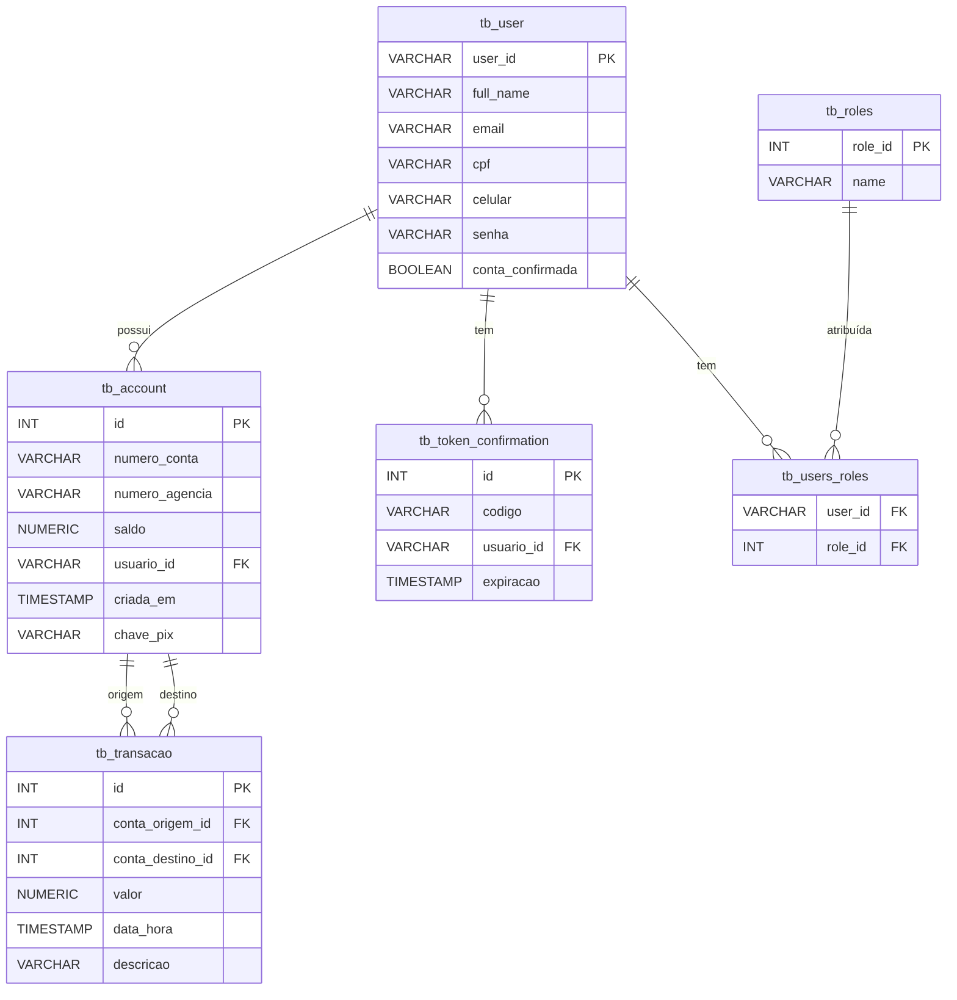

# FakeBank - O banco que cobra, mas não tepaga

## Diagrama ER




## Fluxo
```mermaid
flowchart TD
    A[Usuário cria conta bancária] --> B[Conta criada com saldo inicial de R$10.000]
    B --> C[Usuário opcionalmente cadastra chave PIX]
    C --> D["Chave PIX validada - email, CPF ou celular"]

    B --> E[Usuário deseja fazer uma transferência PIX]
    E --> F[Informa valor e chave PIX do destinatário]
    F --> G[Busca conta destino pela chave PIX]
    G --> H[Verifica saldo disponível]

    H --> I{Saldo suficiente?}
    I -- Não --> J[Erro: Saldo insuficiente]
    I -- Sim --> K[Debita 100% da conta origem]
    K --> L[Aplica taxa de 15 por cento]
    L --> M[Credita 85% na conta destino]
    M --> N[Registra transação no histórico]

    N --> O[Usuário pode consultar extrato]
    O --> P[Lista transações enviadas e recebidas]
     
